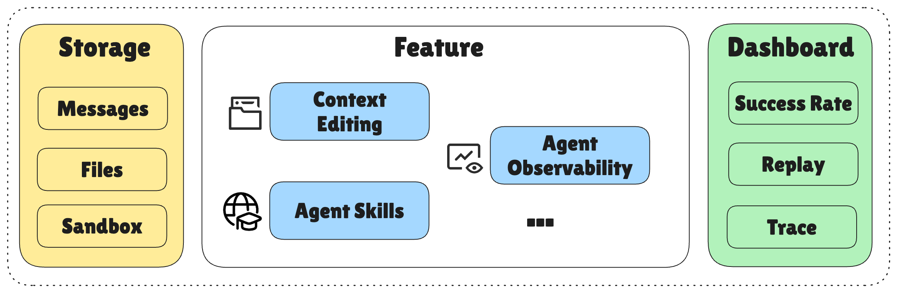
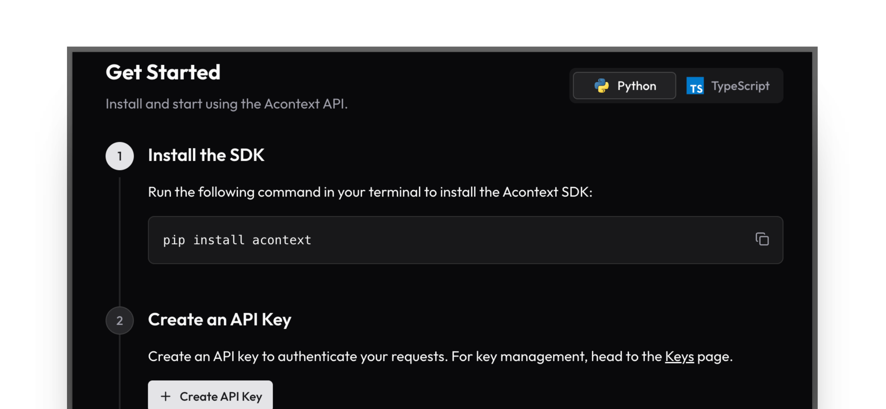
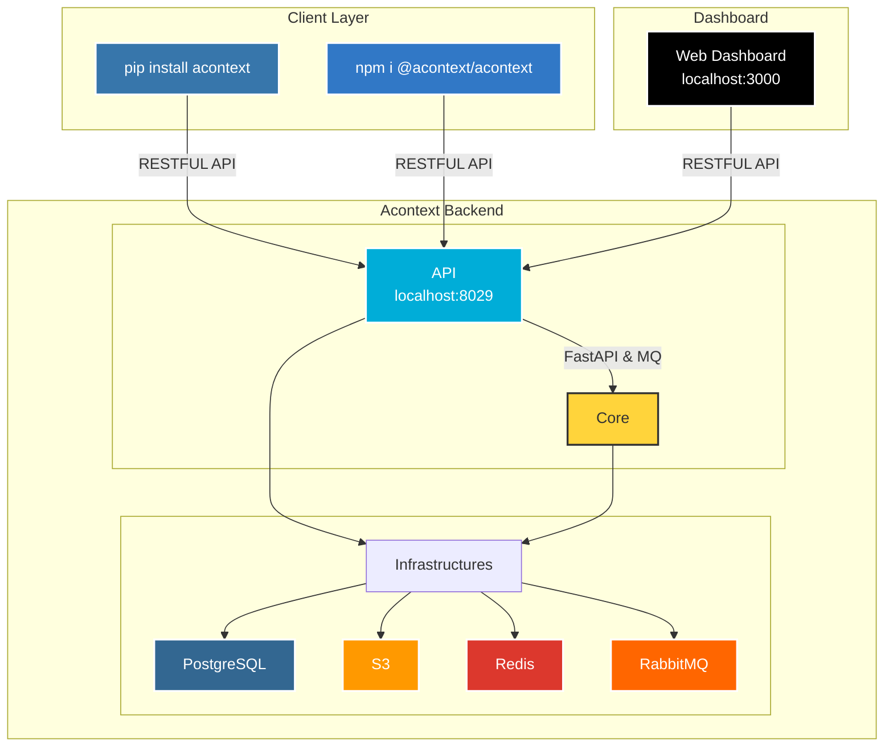

<div align="center">
  <a href="https://discord.acontext.io">
      
  </a>
  <p>
    <h4>Context Data Platform for Building Cloud-native AI Agents</h4>
  </p>
  <p align="center">
    <a href="https://pypi.org/project/acontext/"></a>
    <a href="https://www.npmjs.com/package/@acontext/acontext"></a>
    <a href="https://github.com/memodb-io/acontext/actions/workflows/core-test.yaml"></a>
    <a href="https://github.com/memodb-io/acontext/actions/workflows/api-test.yaml"></a>
    <a href="https://github.com/memodb-io/acontext/actions/workflows/cli-test.yaml"></a>
  </p>
  <p align="center">
    <a href="https://x.com/acontext_io"></a>
    <a href="https://discord.acontext.io"></a>
  </p>
  <br/>
</div>


*Everyone is telling you how to use their agents. But what if YOU need to build an agent for 100,000 users, how would you start?*

**📦 Problem 1: 99% of your DB is just LLM messages.** 

> Acontext handles context storage and retrieval via PG, Redis, and S3 for you. TWO SDKs cover everything
>

**✂️ Problem 1-1: Manage the context window is tricky** 

> Acontext providers many context editing methods to help you limit the context window

**⏰ Problem 2: Long-running agents are a nightmare.** 

> Acontext has a background agent to track your session state (*i.e.* task, user feedback, progress..)

**💻 Problem 3: Move agent from local to cloud breaks things** 

> Acontext offers sandbox, file disk and agent skills, all available as the agent tool.

**👀 Problem 4: You can't see how your agent is doing.** 

> Store sessions here, then Acontext tells you the agent daily success rate.


<div align="center">
  	<p>Acontext is the Context Data Platform</p>
    <picture>
      
    </picture>
</div>


# 💡 Core Features

- **Context Engineering**
  - [Session](https://docs.acontext.io/store/messages/multi-provider): unified message storage for any llm, any modal.
    - [Context Editing](https://docs.acontext.io/engineering/editing) - manage your context window in one api.
  - [Disk](https://docs.acontext.io/store/disk): save/download artifacts with file path.
  - [Agent Skills](https://docs.acontext.io/store/skill) - empower your agents with agent skills.
  - [Sandbox](https://docs.acontext.io/store/sandbox) - run code, analyze data, export artifacts.


- **Observe agent tasks and user feedback**
  - [Task](https://docs.acontext.io/observe/agent_tasks): collect agent's working status, progress and preferences in near real-time.
- **View everything in one [dashboard](https://docs.acontext.io/observe/dashboard)**

<div align="center">
    <picture>
      
    </picture>
  <p>Dashboard of Agent Success Rate and Other Metrics</p>
</div>


# 🚀 Connect to Acontext

1. Go to [Acontext.io](https://acontext.io), claim your free credits.
2. Go through a one-click onboarding to get your API Key: `sk-ac-xxx`

<div align="center">
    <picture>
      
    </picture>
</div>


<details>
<summary>💻 Self-host Acontext</summary>

We have an `acontext-cli` to help you do quick proof-of-concept. Download it first in your terminal:

```bash
curl -fsSL https://install.acontext.io | sh
```

You should have [docker](https://www.docker.com/get-started/) installed and an OpenAI API Key to start an Acontext backend on your computer:

```bash
mkdir acontext_server && cd acontext_server
acontext docker up
```

> [!IMPORTANT]
>
> Make sure your LLM has the ability to [call tools](https://platform.openai.com/docs/guides/function-calling). By default, Acontext will use `gpt-4.1`.

`acontext docker up` will create/use  `.env` and `config.yaml` for Acontext, and create a `db` folder to persist data.


Once it's done, you can access the following endpoints:

- Acontext API Base URL: http://localhost:8029/api/v1
- Acontext Dashboard: http://localhost:3000/

</details>


# 🧐 Use Acontext to build Agent

Download end-to-end scripts with `acontext`:

**Python**

```bash
acontext create my-proj --template-path "python/openai-basic"
```

> More examples on Python:
>
> - `python/openai-agent-basic`: openai agent sdk template
> - `python/agno-basic`: agno framework template
> - `python/openai-agent-artifacts`: agent can edit and download artifacts.

**Typescript**

```bash
acontext create my-proj --template-path "typescript/openai-basic"
```

> More examples on Typescript:
>
> - `typescript/vercel-ai-basic`: agent in @vercel/ai-sdk


> [!NOTE]
>
> Check our example repo for more templates: [Acontext-Examples](https://github.com/memodb-io/Acontext-Examples).
>
> We're cooking more full-stack Agent Applications! [Tell us what you want!](https://discord.acontext.io)


## Step-by-step Quickstart

<details>
<summary>click to open</summary>


We're maintaining Python [](https://pypi.org/project/acontext/) and Typescript [](https://www.npmjs.com/package/@acontext/acontext) SDKs. The snippets below are using Python.

## Install SDKs

```
pip install acontext # for Python
npm i @acontext/acontext # for Typescript
```


## Initialize Client

```python
import os
from acontext import AcontextClient

client = AcontextClient(
    api_key=os.getenv("ACONTEXT_API_KEY"),
)

# If you're using self-hosted Acontext:
# client = AcontextClient(
#     base_url="http://localhost:8029/api/v1",
#     api_key="sk-ac-your-root-api-bearer-token",
# )
```

> [📖 async client doc](https://docs.acontext.io/settings/core)


## Store

Acontext can manage agent sessions and artifacts.

### Save Messages [📖](https://docs.acontext.io/api-reference/session/store-message-to-session)

Acontext offers persistent storage for message data. When you call `session.store_message`, Acontext will persist the message and start to monitor this session:

<details>
<summary>Code Snippet</summary>

```python
session = client.sessions.create()

messages = [
    {"role": "user", "content": "I need to write a landing page of iPhone 15 pro max"},
    {
        "role": "assistant",
        "content": "Sure, my plan is below:\n1. Search for the latest news about iPhone 15 pro max\n2. Init Next.js project for the landing page\n3. Deploy the landing page to the website",
    }
]

# Save messages
for msg in messages:
    client.sessions.store_message(session_id=session.id, blob=msg, format="openai")
```

> [📖](https://docs.acontext.io/store/messages/multi-modal) We also support multi-modal message storage and anthropic SDK.


</details>

### Load Messages [📖](https://docs.acontext.io/api-reference/session/get-messages-from-session)

Obtain your session messages using `sessions.get_messages`

<details>
<summary>Code Snippet</summary>

```python
r = client.sessions.get_messages(session.id)
new_msg = r.items

new_msg.append({"role": "user", "content": "How are you doing?"})
r = openai_client.chat.completions.create(model="gpt-4.1", messages=new_msg)
print(r.choices[0].message.content)
client.sessions.store_message(session_id=session.id, blob=r.choices[0].message)
```

</details>

<div align="center">
    <picture>
      
    </picture>
  <p>You can view sessions in your local Dashboard</p>
</div>


### Artifacts [📖](https://docs.acontext.io/store/disk)

Create a disk for your agent to store and read artifacts using file paths:

<details>
<summary>Code Snippet</summary>

```python
from acontext import FileUpload

disk = client.disks.create()

file = FileUpload(
    filename="todo.md",
    content=b"# Sprint Plan\n\n## Goals\n- Complete user authentication\n- Fix critical bugs"
)
artifact = client.disks.artifacts.upsert(
    disk.id,
    file=file,
    file_path="/todo/"
)


print(client.disks.artifacts.list(
    disk.id,
    path="/todo/"
))

result = client.disks.artifacts.get(
    disk.id,
    file_path="/todo/",
    filename="todo.md",
    with_public_url=True,
    with_content=True
)
print(f"✓ File content: {result.content.raw}")
print(f"✓ Download URL: {result.public_url}")        
```
</details>


<div align="center">
    <picture>
      
    </picture>
  <p>You can view artifacts in your local Dashboard</p>
</div>


## Observe [📖](https://docs.acontext.io/observe)

For every session, Acontext will **automatically** launch a background agent to track the task progress and user feedback. **It's like a background TODO agent**. Acontext will use it to observe your daily agent success rate.

You can use the SDK to retrieve the current state of the agent session, for Context Engineering like Reduction and Compression. 

<details>
<summary>Full Script</summary>

```python
from acontext import AcontextClient

# Initialize client
client = AcontextClient(
    base_url="http://localhost:8029/api/v1", api_key="sk-ac-your-root-api-bearer-token"
)

# Create a project and session
session = client.sessions.create()

# Conversation messages
messages = [
    {"role": "user", "content": "I need to write a landing page of iPhone 15 pro max"},
    {
        "role": "assistant",
        "content": "Sure, my plan is below:\n1. Search for the latest news about iPhone 15 pro max\n2. Init Next.js project for the landing page\n3. Deploy the landing page to the website",
    },
    {
        "role": "user",
        "content": "That sounds good. Let's first collect the message and report to me before any landing page coding.",
    },
    {
        "role": "assistant",
        "content": "Sure, I will first collect the message then report to you before any landing page coding.",
      	"tool_calls": [
            {
                "id": "call_001",
                "type": "function",
                "function": {
                    "name": "search_news",
                    "arguments": "{\"query\": \"iPhone news\"}"
                }
            }
        ]
    },
]

# Store messages in a loop
for msg in messages:
    client.sessions.store_message(session_id=session.id, blob=msg, format="openai")

# Wait for task extraction to complete
client.sessions.flush(session.id)

# Display extracted tasks
summary = client.sessions.get_session_summary(session_id)

print("Agent previous tasks:", summary)
```
> `flush` is a blocking call, it will wait for the task extraction to complete.
> You don't need to call it in production, Acontext has a [buffer mechanism](https://docs.acontext.io/observe/buffer) to ensure the task extraction is completed right on time.

</details>

Example Task Return:

```txt
<task id="1" description="Search for the latest news about iPhone 15 pro max">
<progress>
1. Searched and found key specifications
2. Compiled feature comparison
</progress>
<user_preference>
1. Focus on camera capabilities
2. Make it mobile-responsive
</user_preference>
</task>
<task id="2" description="Initialize Next.js project">
<progress>
1. Created project with latest template
</progress>
</task>
```


You can view the session tasks' statuses in the Dashboard:

<div align="center">
    <picture>
      
    </picture>
  <p>A Task Demo</p>
</div>


# 🔍 Document

To understand what Acontext can do better, please view [our docs](https://docs.acontext.io/)


# ❤️ Stay Updated

Star Acontext on Github to support and receive instant notifications 


# 🏗️ Architecture

<details>
<summary>click to open</summary>




# 🤝 Stay Together

Join the community for support and discussions:

-   [Discuss with Builders on Acontext Discord](https://discord.acontext.io) 👻 
-  [Follow Acontext on X](https://x.com/acontext_io) 𝕏 


# 🌟 Contributing

- Check our [roadmap.md](./ROADMAP.md) first.
- Read [contributing.md](./CONTRIBUTING.md)


# 🥇 Badges

 

```md
[](https://acontext.io)

[](https://acontext.io)
```


# 📑 LICENSE

This project is currently licensed under [Apache License 2.0](LICENSE).

